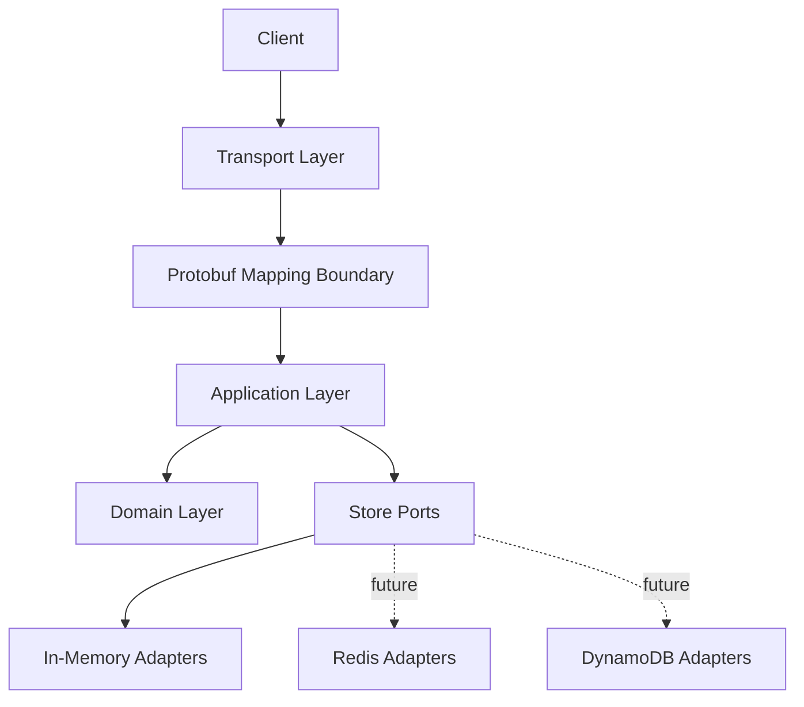
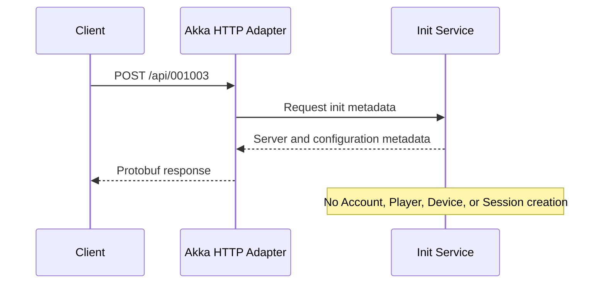
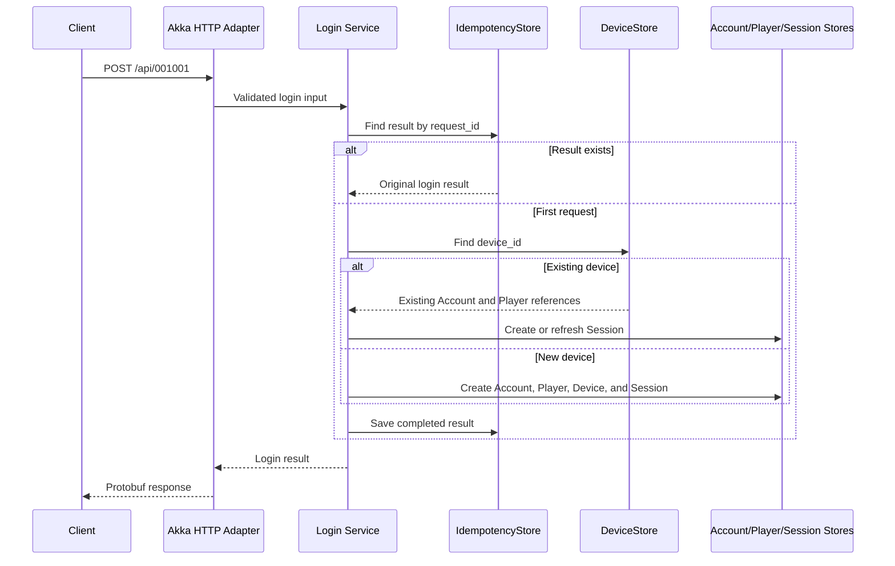
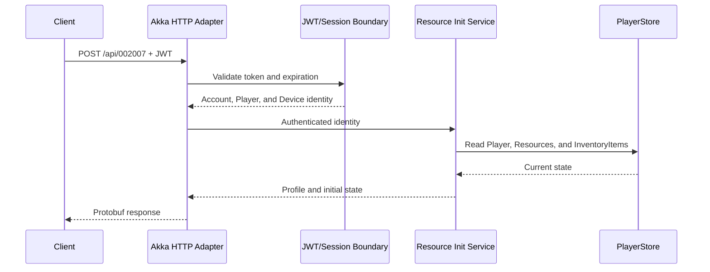

# Architecture

## Architectural Style

Mini Intern Server Project uses a layered architecture with explicit transport, application, domain, and store boundaries. Slice 1 begins with in-memory adapters so behavior and contracts can be established before infrastructure is introduced.



## Layers and Boundaries

### Transport Layer

The transport layer exposes HTTP routes, reads request bodies and headers, invokes mapping and application services, and converts results to HTTP responses. Akka HTTP 10.2.0 and Akka Streams 2.6.9 remain adapter technologies at this boundary.

### Protobuf Mapping Boundary

Generated Protobuf messages are transport contracts, not domain objects. Dedicated mapping at the application edge converts request messages into application inputs and results into response messages. Generated classes do not enter the domain or store interfaces.

### Application Layer

Application services coordinate use cases: init, login, and player resource initialization. They enforce use-case rules, invoke domain behavior, issue or validate sessions through appropriate boundaries, and use store ports.

### Domain Layer

The domain layer defines accepted concepts, identities, relationships, and business rules. It does not import Akka types, generated Protobuf types, Redis or AWS clients, or persistence schemas.

### Store Boundary

Slice 1 defines these conceptual ports:

- `AccountStore`
- `DeviceStore`
- `PlayerStore`
- `SessionStore`
- `IdempotencyStore`

In-memory adapters implement them initially. Future DynamoDB adapters may persist Accounts, Devices, and Players; future Redis adapters may persist Sessions and idempotency results. Services and endpoints must not change when backing implementations change.

## Dependency Direction

Dependencies point from adapters toward application and domain abstractions:

```text
HTTP/Akka adapter → application services → domain
                               ↓
                         store interfaces
                               ↑
                   in-memory/future adapters
```

The domain owns no outward technology dependency. Application services depend on store interfaces, not concrete storage. Infrastructure adapters depend on the interfaces they implement.

## In-Memory-First Strategy

In-memory stores keep Slice 1 focused on behavior and testability. Their process-local data is ephemeral and is not a production durability model. Infrastructure dependencies are introduced only with the adapters that require them. Redis, DynamoDB, SQS, Docker Compose, LocalStack, Terraform, CloudWatch, and AWS deployment are future scope.

## Slice 1 Request Flows

### Public Init



The service returns server time, contract version, configuration version, minimum client version, and maintenance status. No authentication or state creation occurs.

### Idempotent Login



If `account_id` is supplied, the application validates it against known identity rather than trusting it. The idempotency boundary must ensure retries cannot produce duplicate identities or divergent results.

### Player Resource Initialization



Player identity comes only from the validated JWT. The endpoint performs reads and must not mutate gameplay state.

## Boundary Rules

- Domain code must not depend on Akka HTTP, Akka Streams, AWS SDKs, Redis clients, or generated Protobuf classes.
- Application services must not depend on concrete in-memory, Redis, or DynamoDB adapters.
- Route code must not contain domain or persistence logic.
- Generated Protobuf classes must remain separate from domain models.
- Store adapters must not change endpoint contracts or service behavior.
- ProcessContext is request-scoped application data and is never persisted as Player state.
