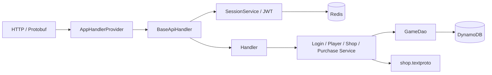

# Kiến trúc demo

Main tạo dependency, chuẩn bị bảng và đăng ký 10 endpoint. BaseApiHandler kiểm tra method theo @ApiHandler (POST cho flow game, GET cho thông tin), content type cho POST, giới hạn body 64 KiB, đọc X-Request-Id và xác thực Session. GET thông tin không nhận body và luôn trả JSON. Body/identity chỉ thuộc request hiện tại; handler không giữ Player của request trong field.

Handler parse Protobuf → gọi service → trả Protobuf. BaseApiHandler chuyển request JSON bằng JsonFormat sang cùng message; ApiResult có thể in JSON từ response Protobuf. Swagger UI/OpenAPI được serve từ classpath tại /swagger/, dùng WebJar assets local. Các thao tác Redis/Dynamo đồng bộ chạy trên dispatcher 8 thread riêng để giữ thread HTTP cho network.

## DynamoDB

Nhóm /api/info/ gọi cùng PlayerService/ShopService/SessionService: Player và Resource đọc DynamoDB, Package đọc ShopCatalog, Session kiểm tra JWT + Redis. Các API này không ghi dữ liệu hoặc tạo DailyOffer.

Một bảng GAME_TABLE, partition key id kiểu String; không sort key, GSI hay scan trong runtime.

| Key | Dữ liệu |
| --- | --- |
| device:<device_id> | account_id, player_id |
| account:<account_id> | device_id, player_id |
| player:<player_id> | account_id, version, resources map, daily snapshot bytes |
| purchase:<player_id>:<request_id> | offer_id, amount, response bytes |

Tạo Device/Account/Player là transaction có condition chưa tồn tại. InitialResources được cấp tại bước này; Player Init chỉ đọc.

Snapshot daily nằm cùng Player. Khi hết hạn, service tạo snapshot rồi ghi nếu version còn đúng; request cạnh tranh đọc lại snapshot thắng. Mua dùng condition version và transaction ghi Player + receipt. Vì vậy tài nguyên/lượt mua/receipt cùng thành công hoặc cùng thất bại.

GetItem dùng consistentRead. Purchase kiểm tra lại receipt sau khi đọc Player để xử lý retry đồng thời. Receipt được lưu bền, không TTL trong phạm vi demo.

## Redis

Key được prefix bằng GAME_TABLE. session:<device_id> giữ Session ID với TTL 12 giờ; login:<request_id> giữ input/response cùng TTL. Lua publish session và cache login atomically. Replay login không ghi đè Session mới hơn; token cũ bị từ chối sau lần login mới.

Redis mất Session thì client login lại. Account/Player, tài nguyên và purchase receipt vẫn nằm trong DynamoDB.

## Cấu hình

[shop.textproto](../src/main/resources/shop.textproto) dùng ShopBlueprint: default rewards cho static, min/max cho daily, slot/candidate/discount/cycle. ShopCatalog validate lúc startup. Clock và Random truyền vào service để test đổi ngày; không scheduler.

EC2 chạy app + Redis; DynamoDB là dịch vụ AWS cùng region. Xem [DEPLOYMENT.md](DEPLOYMENT.md).
