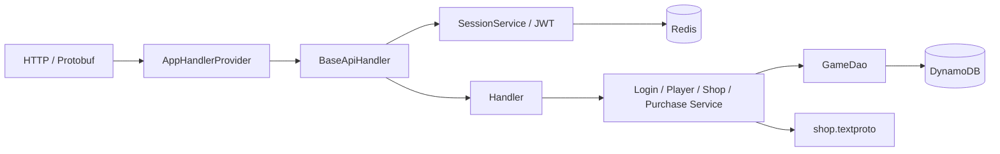

# Demo architecture

Main creates dependencies, prepares the table, and registers 10 endpoints. BaseApiHandler checks the method against @ApiHandler (POST for game flows, GET for information), checks POST content type, limits bodies to 64 KiB, reads X-Request-Id, and authenticates Session. Information GET requests accept no body and always return JSON. Body/identity belong only to the current request; handlers do not retain its Player in a field.

Handlers parse Protobuf → call services → return Protobuf. BaseApiHandler converts JSON requests with JsonFormat into the same messages; ApiResult can render JSON from Protobuf responses. Swagger UI/OpenAPI are served from the classpath at /swagger/, using local WebJar assets. Synchronous Redis/Dynamo operations run on a dedicated 8-thread dispatcher to leave HTTP threads available for networking.

## DynamoDB

The /api/info/ group calls the same PlayerService/ShopService/SessionService: Player and Resource read DynamoDB, Packages read ShopCatalog, and Session checks JWT + Redis. These APIs neither write data nor create DailyOffers.

One GAME_TABLE table, with a String partition key id; no sort key, GSI, or runtime scans.

| Key | Data |
| --- | --- |
| device:<device_id> | account_id, player_id |
| account:<account_id> | device_id, player_id |
| player:<player_id> | account_id, version, resources map, daily snapshot bytes |
| purchase:<player_id>:<request_id> | offer_id, amount, response bytes |

Device/Account/Player creation is a transaction conditioned on their absence. InitialResources are granted at this step; Player Init only reads.

The daily snapshot is stored with Player. On expiry, the service creates a snapshot and writes it only if the version still matches; competing requests reread the winning snapshot. Purchases use a version condition and a transaction writing Player + receipt. Resources/purchase count/receipt therefore succeed or fail together.

GetItem uses consistentRead. Purchase rechecks the receipt after reading Player to handle concurrent retries. Receipts are durable, with no TTL in the demo scope.

## Redis

Keys are prefixed with GAME_TABLE. session:<device_id> stores Session ID with a 12-hour TTL; login:<request_id> stores input/response with the same TTL. Lua publishes the session and login cache atomically. Login replay does not overwrite a newer Session; the old token is rejected after a new login.

If Redis loses a Session, the client logs in again. Account/Player, Resources, and purchase receipts remain in DynamoDB.

## Configuration

[shop.textproto](../src/main/resources/shop.textproto) uses ShopBlueprint: default rewards for static, min/max for daily, slot/candidate/discount/cycle. ShopCatalog validates it at startup. Clock and Random are injected into services to test day changes; no scheduler is used.

EC2 runs the app + Redis; DynamoDB is the AWS service in the same region. See [DEPLOYMENT.md](DEPLOYMENT.md).
