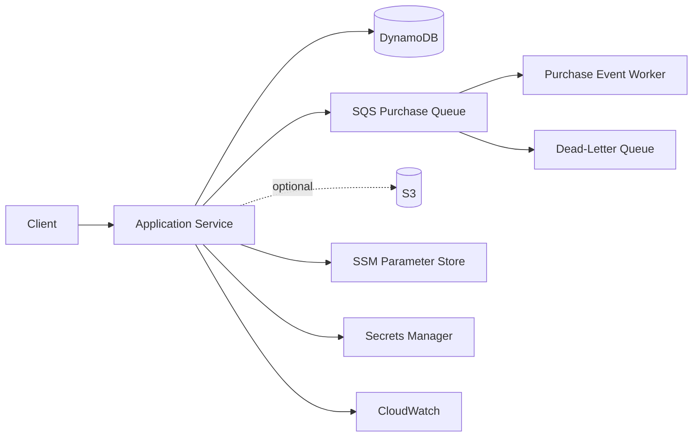

# AWS Free-Tier Guidance

## Status

All AWS infrastructure described here is **future scope** for a development environment. Slice 1 uses in-memory stores and requires no AWS resources. Free-tier eligibility, service pricing, and regional availability can change; verify current AWS pricing before provisioning anything.

## Future Development Architecture

Redis is not shown as an assumed managed AWS component because managed Redis can create always-on cost. Its future hosting choice requires a separate cost and operational decision.

## Planned Service Roles

### DynamoDB

DynamoDB may store Accounts, Devices, and Players through future store adapters. Use on-demand or carefully selected capacity only after measuring the development workload. Define keys and indexes from implemented access patterns rather than speculative scale.

### SQS and DLQ

SQS may carry asynchronous Purchase events after purchase functionality exists. A DLQ must capture messages that exceed the retry policy. Consumers must be idempotent, and queue retention, visibility timeout, and redrive settings must match measured processing behavior.

### S3

S3 is optional for versioned configuration artifacts or other immutable development assets. It should not be introduced until a concrete use case exists. Block public access unless public delivery is explicitly required.

### SSM Parameter Store

SSM Parameter Store may hold non-secret runtime configuration. Parameters should be namespaced by project and environment and accessed only by the application role that needs them.

### Secrets Manager

Secrets Manager may hold sensitive values such as signing or service credentials when secret rotation or managed secret lifecycle is required. Do not place secrets in source control, images, logs, or general parameters.

## IAM Least Privilege

- Give each application, worker, and deployment role only the actions and resources it requires.
- Separate runtime permissions from infrastructure deployment permissions.
- Avoid wildcard actions and resources when resource-level controls exist.
- Use temporary role credentials rather than long-lived access keys.
- Require multi-factor authentication for privileged human access.
- Review and remove unused roles, policies, and credentials.

## Cost Controls

- Create an AWS Budget and billing alerts before provisioning resources.
- Use one selected region for the development environment to reduce duplication and data transfer.
- Tag resources with project, environment, owner, and expiry information.
- Prefer scale-to-zero or request-priced services for intermittent development workloads.
- Review the bill and Cost Explorer regularly.

Major cost risks include NAT Gateways, managed Redis, continuously running compute, load balancers, cross-region or internet data transfer, verbose log retention, provisioned excess capacity, and forgotten snapshots or storage. “Free tier” must not be treated as a guarantee of zero cost.

## Cleanup

- Destroy temporary stacks immediately after experiments.
- Purge or delete unused queues, DLQs, tables, buckets, logs, snapshots, secrets, parameters, network resources, and compute.
- Empty versioned S3 buckets before deletion.
- Check every region for leftover resources.
- Verify billing after cleanup because retained data and networking resources may continue to incur charges.

## Scope Gate

No AWS service should be provisioned until its corresponding adapter or deployment milestone is ready, local behavior is tested, a budget is active, and teardown is documented. AWS deployment remains the final roadmap milestone rather than a Slice 1 requirement.
