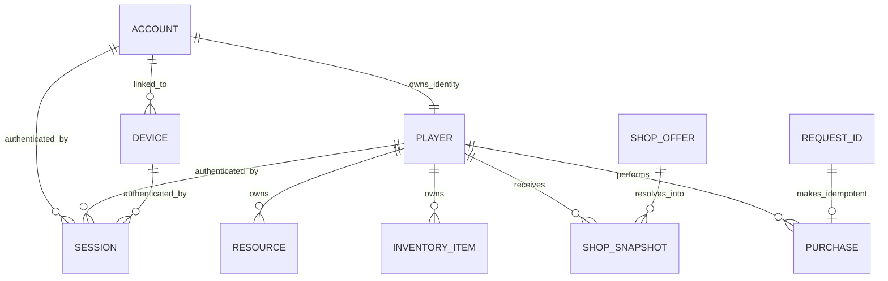

# Domain Model

## Purpose

This document defines the business vocabulary for Mini Intern Server Project. Domain concepts describe game and identity behavior; they do not prescribe frameworks, persistence products, deployment topology, or transport representations.

## Accepted Terms

### Account

An **Account** is the player-owned identity. An Account owns a Player identity and may be linked to multiple Devices in the future, even if the MVP initially supports one Device per Account.

### Device

A **Device** is a login client associated with an Account. It supplies the `device_id` used to recover the corresponding Account and Player during login.

### Player

A **Player** owns gameplay state, including Resources and InventoryItems. The Player is distinct from the Account identity and Device login client.

### Session

A **Session** authenticates a specific Account, Player, and Device combination. Its token has a finite expiration time.

### Resource

A **Resource** is a currency or gameplay quantity owned by a Player. Examples may include soft currency or energy, but the concrete resource catalog is not defined by Slice 1.

### InventoryItem

An **InventoryItem** is an item and quantity owned by a Player. Slice 1 reads inventory during resource initialization but does not purchase or mutate items.

### ShopOffer

A **ShopOffer** is shared game configuration describing a purchasable package. Shop behavior is future scope.

### ShopSnapshot

A **ShopSnapshot** is a player-specific, shop-cycle-specific resolved offer. It is derived for one Player and one shop cycle. Shop behavior is future scope.

### Purchase

A **Purchase** atomically changes Player Resources and InventoryItems. Purchase behavior is future scope.

### RequestId

A **RequestId** identifies a retryable operation and provides idempotency. For login, repeating the same RequestId returns the original result rather than creating duplicate identities or sessions.

### ApiError

An **ApiError** is the stable client-facing failure representation. It exposes a documented error code and safe message without leaking internal exceptions or infrastructure details.

### ProcessContext

**ProcessContext** is request-scoped application context. It may carry information needed while processing one request, but it is not a domain entity and must not be persisted as Player data.

## Relationships

A Session belongs to one Account, one Player, and one Device. A Player owns Resources and InventoryItems. ShopOffer is shared configuration, while ShopSnapshot is resolved for one Player and shop cycle. Purchase atomically changes Player state. RequestId applies to retryable operations; in Slice 1, its defined use is login idempotency.

## Identity Rules

- Account owns Player identity.
- Account may be linked to multiple Devices.
- Device represents a login client.
- Session binds Account, Player, and Device.
- Player identity for an authenticated request comes from the validated Session token, not request data.
- A supplied `account_id` is evidence to validate, never authority to trust implicitly.

## Resource and Inventory Responsibilities

Resources and InventoryItems are Player-owned state. Slice 1 returns their current values without mutation. A future Purchase will update both atomically so partial changes cannot occur.

## RequestId and Idempotency

A client assigns RequestId to a retryable operation. The application records the completed result against that identifier. A repeated request with the same RequestId returns the recorded result, even if other login state has since changed. A new RequestId is a distinct operation and may create or refresh a Session for an existing Device.

## ApiError and Domain Errors

Domain errors describe failed business rules inside the application, such as an identity mismatch. ApiError maps failures into a stable external representation. Transport adapters translate validation, authentication, domain, and unexpected failures into ApiError responses. Domain code does not depend on ApiError transport serialization.

## Domain Versus Implementation

The domain model contains the concepts and rules above. Akka HTTP routes, generated Protobuf messages, JWT libraries, in-memory collections, Redis clients, DynamoDB tables, build tasks, configuration variables, and deployment services are implementation details outside the domain. Changing those details must not change the meaning of Account, Player, Session, or other domain concepts.
