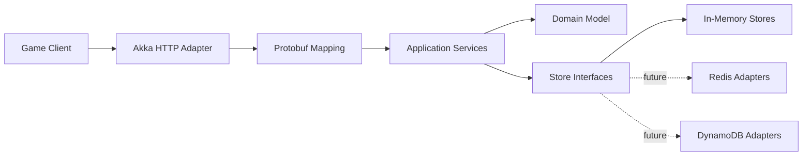

# Mini Intern Server Project

## Overview

Mini Intern Server Project is a small game backend inspired by a larger production game server. It is a learning and portfolio project designed to demonstrate clear API contracts, domain boundaries, idempotent operations, authentication, and replaceable persistence adapters without production-scale complexity.

The intended product flow is:

```text
init
→ login
→ init-resource
→ static shop
→ daily shop
→ purchase
→ asynchronous purchase event
```

Only the first three operations belong to the current implementation slice.

## Goals

- Define stable Protobuf and HTTP contracts.
- Keep transport, application, domain, and storage concerns separate.
- Make login retries safe through `RequestId` idempotency.
- Authenticate player-specific operations with JWT sessions.
- Begin with in-memory stores behind interfaces so infrastructure can change later.
- Provide a focused codebase suitable for learning, testing, and portfolio review.

## Current Scope: Slice 1

Slice 1 contains only:

1. Public init through `POST /api/001003`.
2. Idempotent login through `POST /api/001001`.
3. Authenticated player resource initialization through `POST /api/002007`.

Slice 1 uses Java 11, Gradle, Akka HTTP 10.2.0, Akka Streams 2.6.9, Protocol Buffers 3.21.3, JWT, SLF4J/Logback, JUnit, and in-memory stores.

## Future Milestones

Static shop, daily shop, purchase atomicity, asynchronous purchase events, Redis, DynamoDB, SQS and DLQ processing, S3, SSM Parameter Store, Secrets Manager, Docker Compose, LocalStack, DynamoDB Local, Terraform, CloudWatch, and AWS deployment are **future scope**. Infrastructure dependencies are added only when their corresponding adapters are implemented.

See [ROADMAP.md](ROADMAP.md) for milestone order and acceptance criteria.

## High-Level Architecture



Dependencies point inward. The domain is independent of Akka, generated Protobuf classes, Redis, and AWS services.

## Documentation Index

- [Domain](DOMAIN.md): accepted vocabulary and relationships.
- [Architecture](ARCHITECTURE.md): layers, boundaries, dependencies, and request flows.
- [API contract](API_CONTRACT.md): Slice 1 endpoints, identity rules, and errors.
- [Protobuf guide](PROTO_GUIDE.md): schema organization and compatibility policy.
- [Testing](TESTING.md): test strategy and Slice 1 definition of done.
- [Deployment](DEPLOYMENT.md): local operation and future deployment direction.
- [AWS free-tier guidance](AWS_FREE_TIER.md): future AWS development architecture and cost controls.
- [Agent workflow](AGENT_WORKFLOW.md): responsibilities, handoffs, and repository safety.
- [Roadmap](ROADMAP.md): ordered implementation milestones.

## Reading Guide

Start with this page, then read [DOMAIN.md](DOMAIN.md) and [API_CONTRACT.md](API_CONTRACT.md) to understand the language and current behavior. Continue with [ARCHITECTURE.md](ARCHITECTURE.md), [PROTO_GUIDE.md](PROTO_GUIDE.md), and [TESTING.md](TESTING.md) before implementation. Use deployment and roadmap documents for operational context and future planning.
